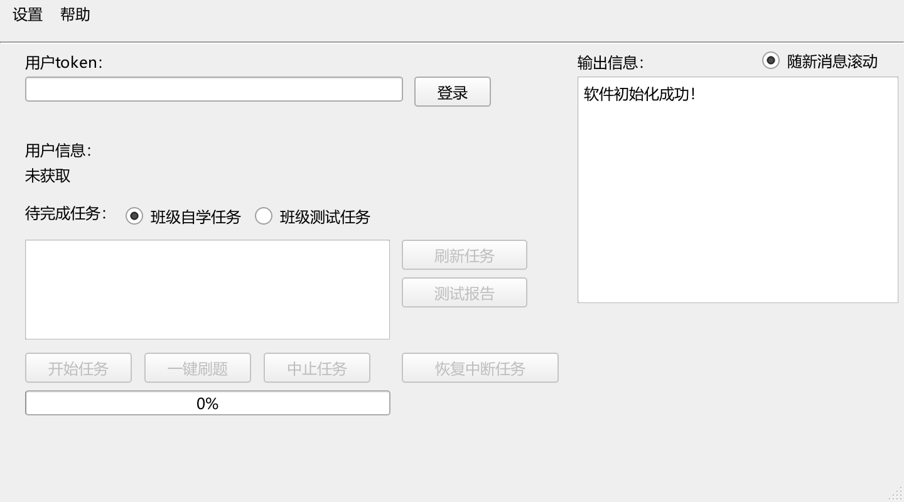

# 词达人一键刷题

**把班级任务、进度查看和中断恢复放在一个桌面窗口里。**

词达人一键刷题（Cidaren / VocabGo）面向班级自学与班级测试任务，修复任务处理流程，优化重复加载和等待，并提供可直接运行的 Windows 版本。

[](https://github.com/chuyc11/cidaren-yijian-shuati/releases/latest)


[](LICENSE)

### [下载 Windows 运行包 →](https://github.com/chuyc11/cidaren-yijian-shuati/releases/latest/download/Easy_Cidaren_Fixed-windows-x64.zip)

[三步上手](#三步上手) · [详细使用指南](docs/QUICKSTART.md) · [常见问题](docs/FAQ.md) · [反馈问题](https://github.com/chuyc11/cidaren-yijian-shuati/issues/new/choose)

Windows 64 位 · 压缩包约 99 MB · 完整解压即可运行 · 无需安装 Python · AI 配置可选

## 你可以用它做什么

| 功能 | 使用时的作用 |
| --- | --- |
| 班级任务处理 | 切换班级自学、班级测试，查看任务进度与得分 |
| 快速模式 | 减少额外等待，复用词形模型和词表缓存，后台预取词汇数据 |
| 单项与批量运行 | 选中一个任务开始，或依次处理当前列表中可执行的未完成任务 |
| 中断恢复 | 重新登录后核对服务器当前进度，继续处理中断任务 |
| 测试报告 | 查看已记录的题目、判分和统计，便于复盘定位问题 |
| 账号隔离 | 恢复记录和任务报告按账号保存，减少切换账号时的进度混用 |
| 可选 AI 辅助 | 配置自己的兼容接口，为部分本地规则未能处理的题目提供补充答案 |

班级测试遇到无法可靠作答的题目时，程序会停止并保留进度。实际速度与可完成情况受网络、课程题型和平台响应影响。

## 界面预览



*真实主界面的未登录预览，不含账号、Token 或个人任务数据。*

## 三步上手

1. **下载并完整解压**：[Windows 运行包](https://github.com/chuyc11/cidaren-yijian-shuati/releases/latest/download/Easy_Cidaren_Fixed-windows-x64.zip)。选择一个可写文件夹，保留包内所有文件。
2. **打开并登录**：双击 `Easy_Cidaren_Fixed.exe`，输入自己的有效 Token，点击「登录」。
3. **选择并开始**：切换「班级自学任务」或「班级测试任务」，选中任务后点击「开始任务」。需要依次处理多个任务时，可使用「一键刷题」。

只移动 EXE 会导致配置、模型或运行依赖缺失。遇到中断时，重新登录并刷新任务，再查看「恢复中断任务」。

**首次使用前需要准备自己的有效 Token。** 本发布包不包含账号凭据，也不附带第三方 Token 抓取工具。未配置 AI 仍可使用本地规则与词形模型。

## 已验证的内容

当前 `v2026.10.06` 版本的发布检查：

| 检查 | 结果 |
| --- | --- |
| 离线回归测试 | 166 项通过，覆盖任务流程、异常恢复、进度、报告与账号隔离等逻辑 |
| Windows 成品自检 | 9 项通过，检查图形界面、本地模型、配置和恢复信息等读写 |
| 中文与空格路径 | 从压缩包解压到含中文、空格的路径后自检通过 |
| 运行时依赖 | 移除环境中的 Python 路径后，打包程序自检通过 |
| 公开下载 | 未登录 GitHub 的下载验证通过，文件 SHA-256 与上传前一致 |

回归与成品自检使用离线、合成数据，不代表所有课程和题型都能得到相同结果。版本变化见 [CHANGELOG.md](CHANGELOG.md)，下载校验文件见 [Releases](https://github.com/chuyc11/cidaren-yijian-shuati/releases/latest)。

## 设置与 AI 配置

常用设置在「设置 → 首选项」中调整，包括快速模式、任务间隔和提示音乐。基础配置保存在 `config/config.json`。

AI 为可选功能：将 `config/ai_config.example.json` 复制为 `config/ai_config.json`，填入自己的 `base_url`、`api_key` 和 `model` 后重启。详细步骤见 [使用指南](docs/QUICKSTART.md#可选ai配置)。接口的费用与额度由你选择的服务决定。

运行产生的配置、学习数据与日志保存在解压目录；发布包已排除原使用者的 Token、AI 密钥和个人记录。分享程序时请使用原始下载包。

## 常见问题与反馈

- **不知道下哪个文件？** 下载名称含 `windows-x64` 的 ZIP；`source.zip` 是给源码使用者的。
- **Token 失效或任务未显示？** 查看 [登录与任务问题](docs/FAQ.md#登录与任务)。
- **没有可靠答案、任务中断或速度不理想？** 查看 [运行与恢复](docs/FAQ.md#运行与恢复)。
- **遇到新的题型或可复现的问题？** [提交问题](https://github.com/chuyc11/cidaren-yijian-shuati/issues/new?template=bug_report.yml)，附上版本、操作步骤和已去除个人信息的报错。
- **有改进建议？** [提出功能建议](https://github.com/chuyc11/cidaren-yijian-shuati/issues/new?template=feature_request.yml)。

如果这个版本帮到了你，欢迎点一个 **Star**，也可以把[项目首页](https://github.com/chuyc11/cidaren-yijian-shuati)分享给需要的朋友。

## 从源码运行与构建

源码版需要 **Windows + Python 3.12**。在项目根目录执行：

```powershell
python -m pip install -r requirements.txt
python main.py
```

离线验证与 Windows 构建：

```powershell
python -m unittest discover -s tests -p "test*.py" -q
python main.py --self-test --self-test-report smoke-report.json
powershell -ExecutionPolicy Bypass -File packaging/build.ps1
```

构建结果位于 `dist/Easy_Cidaren_Fixed/`。自检不会登录或执行线上任务。请保留 `config`、`assets` 和 `en_core_web_sm` 等资源目录。

## 开源许可与致谢

本修复版基于 [ularch/Easy_Cidaren](https://github.com/ularch/Easy_Cidaren)，保留其及 [github123666/cidaren](https://github.com/github123666/cidaren) 的原项目归属，继续按 [GPLv3](LICENSE) 发布。

感谢上游作者和所使用的开源组件。上游原说明见 [docs/UPSTREAM_README.md](docs/UPSTREAM_README.md)，第三方归属见 [THIRD_PARTY_NOTICES.md](THIRD_PARTY_NOTICES.md)，完整许可文本位于 `licenses/` 与模型目录。
